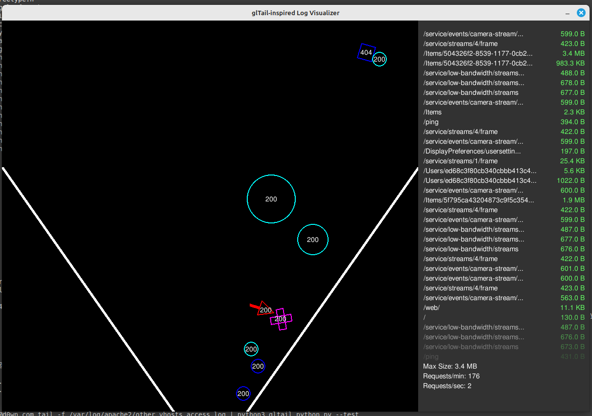

# Apache Log Visualizer

## Overview

`logs_visualizer.py` is a Python script that visualizes Apache web server logs in real-time. It uses `pygame` for graphics rendering and `pymunk` for physics simulation. The script displays HTTP requests as falling shapes (balls, squares, or arrows) that pass through a funnel, with a scrolling info panel showing URLs and request sizes.



### Features
- **Dynamic Visualization**: HTTP requests are represented as shapes:
  - GET requests: Circles (size varies based on response size).
  - POST requests: Arrows (triangle with a tail).
  - DELETE requests: "X" shapes.
  - 404 status: Squares.
- **Physics Simulation**: Shapes fall through a funnel using gravity and collide with elasticity.
- **Info Panel**: Displays URLs (in white) and request sizes (in prasin green) with a fading effect as they scroll.
- **Stats Panel**: Shows the largest response size seen, requests per minute, and requests per second.
- **Test Mode**: Simulates fake requests for testing purposes (15-20 requests per second).

## Requirements

- Python 3.10 or higher
- `pygame` (e.g., version 2.5.2)
- `pymunk` (e.g., version 6.8.1)
- A local graphical environment (e.g., X11 on Linux, or a desktop environment on Windows/Mac)

### Installation

1. Install Python 3.10 or higher.
2. Install the required libraries:
   ```bash
   pip install pygame pymunk
   ```
3. Ensure you have a graphical environment set up (e.g., on Linux, install `libsdl2-2.0-0` for `pygame`).

## Usage

The script can be run in two modes: normal mode (reading real Apache logs) or test mode (simulating fake requests).

### Normal Mode
Pipe Apache logs into the script using `tail`:
```bash
ssh root@exemple.com tail -f /var/log/apache2/access.log | python3 logs_visualizer.py
```

### Test Mode
Run the script in test mode to simulate requests:
```bash
python3 logs_visualizer.py --test
```

### Controls
- Press `R` to reset the maximum response size seen (affects ball scaling).
- Press `Esc` or close the window to exit.


## Adapting to a Different Apache Log Format (Without Vhost)

For Apache logs in the standard `combined` format without a vhost (e.g., `192.168.1.1 - - [08/May/2025:12:00:00 +0000] "GET /page1 HTTP/1.1" 200 1024`), modify the `extract_log_info` method in `logs_visualizer.py` to use this regex:

```python
match = re.search(r'\S+ \S+ \S+ \[[^\]]+\] "(\S+) (\S+) \S+" (\d+) (\d+|-)', line)
```

## Influencing the Physics of the Balls

The physics of the balls (and other shapes) is managed by the `pymunk` library. You can influence their behavior by modifying the following parameters in the script:

### 1. Gravity
- **Location**: In the `# Configuration` section at the top of the script.
- **Parameter**: `GRAVITY`
- **Default Value**: `900`
- **Effect**:
  - Controls the downward force applied to the balls.
  - Higher values make balls fall faster; lower values make them fall slower.
- **How to Modify**:
  - Increase `GRAVITY` to make balls fall faster (e.g., `GRAVITY = 1200`).
  - Decrease `GRAVITY` to make balls fall slower (e.g., `GRAVITY = 500`).
  - Example:
    ```python
    GRAVITY = 1200  # Increase gravity to make balls fall faster
    ```

### 2. Elasticity (Bounciness)
- **Location**: In the `# Configuration` section.
- **Parameter**: `ELASTICITY`
- **Default Value**: `0.8`
- **Effect**:
  - Controls how bouncy the balls are when they collide with the funnel walls or each other.
  - Values range from `0` (no bounce) to `1` (perfectly elastic, full bounce).
- **How to Modify**:
  - Increase `ELASTICITY` for more bounciness (e.g., `ELASTICITY = 1.0`).
  - Decrease `ELASTICITY` for less bounciness (e.g., `ELASTICITY = 0.5`).
  - Example:
    ```python
    ELASTICITY = 1.0  # Make collisions fully elastic (maximum bounciness)
    ```

### 3. Friction
- **Location**: In the `Ball` class, inside the `__init__` method.
- **Parameter**: `self.shape.friction` (and similar for `head_shape`, `tail_shape`, `shape1`, `shape2`).
- **Default Value**: `0.5`
- **Effect**:
  - Controls how much shapes slow down when they slide against the funnel walls.
  - Higher values increase friction (more slowing); lower values decrease friction (less slowing).
- **How to Modify**:
  - Increase friction for more slowing (e.g., `self.shape.friction = 0.8`).
  - Decrease friction for less slowing (e.g., `self.shape.friction = 0.2`).
  - Example:
    ```python
    self.shape.friction = 0.2  # Reduce friction for smoother sliding
    ```
  - Apply this change to all shapes (circle, POST arrow, DELETE "X", etc.) by updating the respective lines in the `__init__` method.

### 4. Initial Velocity
- **Location**: In the `Ball` class, inside the `__init__` method.
- **Parameters**: `vx` and `vy` (initial velocity components).
- **Default Values**:
  - `vx = -200 + random.uniform(-50, 0)` (horizontal velocity, moving left).
  - `vy = random.uniform(-50, 50)` (vertical velocity, random up/down).
- **Effect**:
  - Controls the initial speed and direction of the balls when they spawn.
- **How to Modify**:
  - Increase the horizontal speed by adjusting `vx` (e.g., `vx = -300 + random.uniform(-50, 0)` for faster leftward motion).
  - Adjust the vertical randomness by changing the range of `vy` (e.g., `vy = random.uniform(-100, 100)` for more vertical variation).
  - Example:
    ```python
    vx = -300 + random.uniform(-50, 0)  # Increase leftward speed
    vy = random.uniform(-100, 100)  # Increase vertical variation
    ```

### 5. Mass
- **Location**: In the `Ball` class, inside the `__init__` method.
- **Parameter**: `mass`
- **Default Value**: `mass = self.radius ** 2` (for circles); `1` (for POST/DELETE shapes).
- **Effect**:
  - Affects how balls interact in collisions (heavier balls push lighter ones more).
- **How to Modify**:
  - Increase `mass` for heavier balls (e.g., `mass = (self.radius ** 2) * 2`).
  - Decrease `mass` for lighter balls (e.g., `mass = self.radius ** 2 / 2`).
  - Example:
    ```python
    mass = (self.radius ** 2) * 2  # Make balls heavier for stronger collisions
    ```

### Example: Make Balls Fall Slower and Less Bouncy
To make the balls fall more slowly and reduce their bounciness, you can modify the `GRAVITY` and `ELASTICITY` constants:
```python
GRAVITY = 500  # Reduce gravity for slower falling
ELASTICITY = 0.5  # Reduce bounciness for less elastic collisions
```

## Troubleshooting

- **No Window Appears**:
  - Ensure you have a graphical environment (e.g., X11 on Linux).
  - Check that `pygame` and `pymunk` are installed correctly.
- **Logs Not Displaying**:
  - Verify that your log format matches the expected format.
  - Check the `extract_log_info` method’s regex if logs aren’t being parsed.
- **Performance Issues**:
  - Reduce `MAX_BALLS` in the configuration to limit the number of shapes on screen.

## License

This script is provided as-is, with no warranty. Feel free to modify and distribute it as needed.
